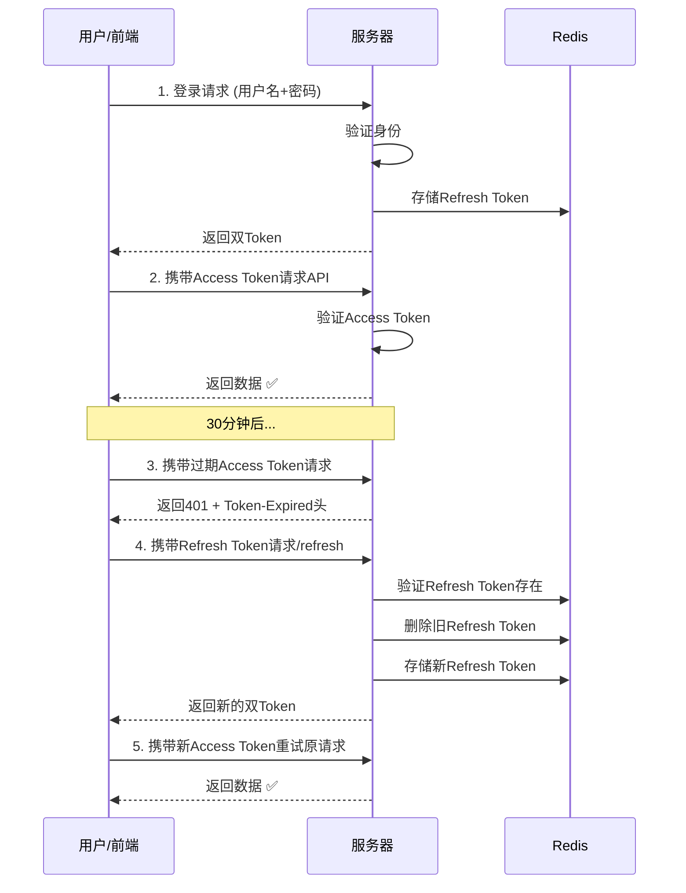

# 双Token机制：概念与原理（面试理论篇）

## 一、什么是双Token机制

双Token机制是指使用两个不同功能的JWT令牌来管理用户认证：

| 令牌类型 | 英文名称 | 有效期 | 核心作用 |
|---------|---------|--------|---------|
| **访问令牌** | Access Token | 短（15-30分钟） | 日常API请求认证 |
| **刷新令牌** | Refresh Token | 长（7-30天） | 用于获取新的Access Token |

```
┌─────────────────────────────────────────────────────────┐
│                    双Token架构图                         │
├─────────────────────────────────────────────────────────┤
│                                                         │
│   登录成功                                               │
│      │                                                  │
│      ▼                                                  │
│   ┌──────────────┐    ┌──────────────┐                 │
│   │ Access Token │    │ Refresh Token│                 │
│   │  (30分钟)    │    │   (7天)      │                 │
│   └──────┬───────┘    └──────┬───────┘                 │
│          │                   │                          │
│          ▼                   │                          │
│   日常API请求携带            │                          │
│          │                   │                          │
│          ▼                   │                          │
│   Access Token过期 ─────────►▼                          │
│   (返回401)            调用/refresh                     │
│                              │                          │
│                              ▼                          │
│                        获取新的双Token                   │
│                                                         │
└─────────────────────────────────────────────────────────┘
```

---

## 二、为什么要用双Token？

### 2.1 单Token的问题

假设只有一个Token，有效期设置为7天：

```
问题1：安全性差
┌────────────────────────────────────┐
│ Day 1: 用户登录，获得Token          │
│ Day 3: Token被黑客窃取              │
│ Day 7: 黑客一直可用该Token访问系统   │
│        (5天的攻击窗口期!)           │
└────────────────────────────────────┘

问题2：用户体验差
┌────────────────────────────────────┐
│ Token有效期30分钟                   │
│ 用户每30分钟就要重新登录一次        │
│ 操作频繁中断，体验极差              │
└────────────────────────────────────┘

问题3：无法吊销
┌────────────────────────────────────┐
│ 发现账号异常，无法立即踢下线         │
│ 必须等Token自然过期                 │
└────────────────────────────────────┘
```

### 2.2 双Token的解决方案

```
安全性提升
┌────────────────────────────────────┐
│ Access Token 30分钟有效             │
│ 即使被盗，攻击窗口只有30分钟          │
│ Refresh Token存储更安全(HttpOnly)   │
└────────────────────────────────────┘

用户体验提升
┌────────────────────────────────────┐
│ 7天内自动续期，无需重新登录           │
│ 后台静默刷新，操作无中断              │
└────────────────────────────────────┘

可控性提升
┌────────────────────────────────────┐
│ Refresh Token存Redis，可随时删除     │
│ 发现异常，立即吊销Refresh Token      │
│ 用户被迫重新登录                     │
└────────────────────────────────────┘
```

---

## 三、双Token的核心原理

### 3.1 Token轮换机制（Rotation）

每次使用Refresh Token获取新Token时，**同时生成新的Refresh Token**，旧的立即失效。

```
首次登录：
  Access Token A  +  Refresh Token A

30分钟后刷新：
  Access Token B  +  Refresh Token B  (Token A 全部失效)

再30分钟后刷新：
  Access Token C  +  Refresh Token C  (Token B 全部失效)
```

**好处**：防止Refresh Token被重复使用（防止重放攻击）

### 3.2 并发请求处理

```
场景：3个请求同时发现Access Token过期

传统做法：发送3次刷新请求 ❌
优化做法：只发1次，其他请求等待 ✅

实现：使用 Promise 队列
┌────────────────────────────────────┐
│ 请求1：发现过期，开始刷新            │
│ 请求2：发现过期，加入等待队列         │
│ 请求3：发现过期，加入等待队列         │
│        ↓                             │
│ 刷新完成，新Token: xxx               │
│        ↓                             │
│ 请求1/2/3 都使用xxx重试              │
└────────────────────────────────────┘
```

### 3.3 存储策略

| Token | 存储位置 | 原因 |
|-------|---------|------|
| Access Token | 内存/Redux/Vuex | 频繁使用，快速读取 |
| Refresh Token | localStorage/HttpOnly Cookie | 需要持久化，相对安全 |

---

## 四、双Token的工作流程



---

## 五、面试金句（背诵）

1. **"双Token的核心是职责分离：Access Token负责访问，Refresh Token负责续期"**

2. **"双Token通过轮换机制防止重放攻击，每次刷新都使旧Token失效"**

3. **"双Token解决了安全性与用户体验的矛盾：短期Token保安全，长期Refresh Token保体验"**

4. **"Refresh Token存储在Redis中，可以实现服务端主动控制用户下线"**

---

## 六、常见问题预告

Q1: 为什么Refresh Token要存Redis？
→ 见文档02：双Token存储设计

Q2: 如果Refresh Token也被盗了怎么办？
→ 见文档03：双Token安全防护

Q3: 双Token和Session哪个好？
→ 见文档04：双Token vs Session对比
